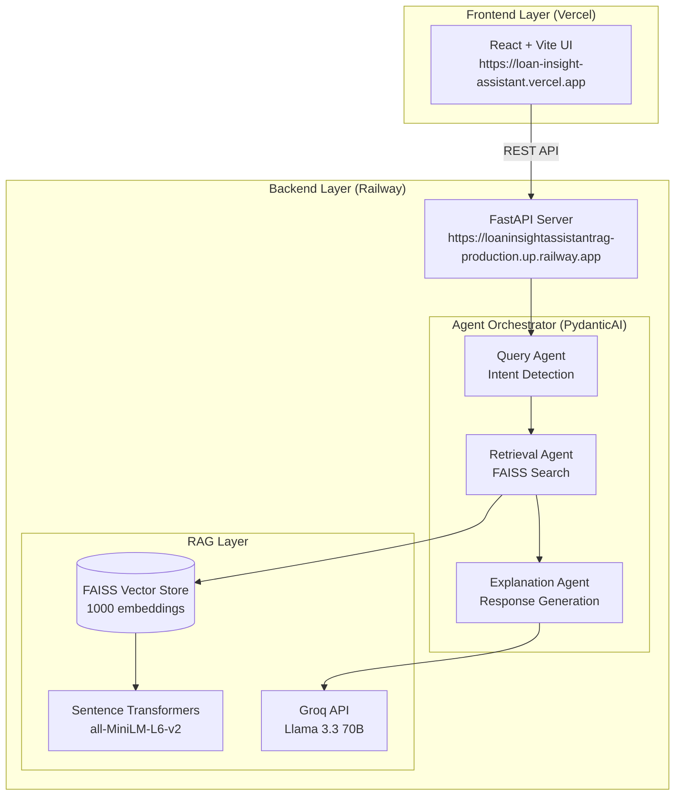

# 🏦 Loan Insight Assistant - Agentic RAG System

<div align="center">

[](https://loan-insight-assistant.vercel.app/)
[](https://loaninsightassistantrag-production.up.railway.app/docs)
[](LICENSE)

**An intelligent, production-ready RAG-based AI assistant for explaining loan decisions using historical data**

[Features](#-features) • [Architecture](#-architecture) • [Quick Start](#-quick-start) • [API Reference](API_DOCS.md) • [Team](#-team-contributions)

</div>

---

## 📋 Overview

The **Loan Insight Assistant** is an enterprise-grade Retrieval-Augmented Generation (RAG) system designed for banking teams to understand loan approval/rejection patterns through historical data analysis. Built with a multi-agent architecture, it provides audit-friendly, evidence-based explanations without making predictions or classifications.

### 🎯 Core Capabilities

- **Intelligent Query Understanding**: Automatically interprets user intent and extracts relevant constraints
- **Semantic Search**: FAISS-powered similarity search across 1000+ historical loan cases
- **Multi-Agent Orchestration**: PydanticAI-based agent pipeline for structured, reliable responses
- **Compliance-First Design**: Non-predictive, evidence-based explanations suitable for audit trails
- **Production-Ready**: Full CI/CD pipeline, Docker support, and cloud deployment

---

## ✨ Features

### 🤖 Agentic RAG Pipeline

- **Query Understanding Agent**: Interprets natural language queries, detects intent (WHY_REJECTED, WHY_APPROVED, SIMILAR_CASES, RISK_ANALYSIS)
- **Loan Retrieval Agent**: Fetches top-K similar historical cases using FAISS vector search
- **Explanation & Compliance Agent**: Generates structured, audit-friendly explanations with evidence points and risk notes

### 🔍 Advanced Retrieval

- **Vector Search**: Sentence-transformers with FAISS (CPU-optimized)
- **Hybrid Routing**: LLM-powered query classification (Mathematical vs Semantic)
- **Smart Fallbacks**: Keyword-based routing when LLM is unavailable

### 🛡️ Enterprise Features

- **Type-Safe Schemas**: Pydantic validation across all agent outputs
- **Error Handling**: Comprehensive fallback mechanisms for edge cases
- **Audit Trails**: Structured logging and compliance disclaimers
- **Scalable Architecture**: Modular design supporting horizontal scaling

---

## 🏗️ Architecture



### Technology Stack

**Backend**
- **Framework**: FastAPI 0.103.0
- **Agents**: PydanticAI (custom implementation)
- **LLM**: Groq API (Llama 3.3 70B Versatile)
- **Vector DB**: FAISS (CPU-optimized)
- **Embeddings**: Sentence Transformers (all-MiniLM-L6-v2)
- **Validation**: Pydantic 2.12.5

**Frontend**
- **Framework**: React 19 + Vite
- **State Management**: TanStack Query (React Query)
- **Styling**: Tailwind CSS
- **Charts**: Recharts

**DevOps**
- **CI/CD**: GitHub Actions
- **Containerization**: Docker
- **Backend Hosting**: Railway
- **Frontend Hosting**: Vercel

---

## 🚀 Quick Start

### Prerequisites

- Python 3.10+
- Node.js 20+
- Git

### Local Development

#### 1. Clone the Repository

```bash
git clone https://github.com/BL-Diptanshu/Loan_Insight_Assistant_RAG.git
cd Loan_Insight_Assistant_RAG
```

#### 2. Set Up Environment Variables

Create a `.env` file in the root directory:

```env
GROQ_API_KEY=your_groq_api_key_here
```

Get your free Groq API key at: https://console.groq.com/keys

#### 3. Run with Convenience Scripts (Windows)

```powershell
# Start both backend and frontend
.\start.ps1

# Stop all services
.\stop.ps1
```

#### 4. Manual Setup

**Backend:**
```bash
cd backend
python -m venv venv
venv\Scripts\activate  # Windows
# source venv/bin/activate  # Linux/Mac

pip install -r requirements.txt
uvicorn main:app --reload
```

**Frontend:**
```bash
cd frontend
npm install
npm run dev
```

#### 5. Access the Application

- **Frontend**: http://localhost:5173
- **Backend API**: http://localhost:8000
- **API Docs**: http://localhost:8000/docs

---

## 📚 API Reference

See [API_DOCS.md](API_DOCS.md) for comprehensive API documentation including:

- Authentication
- Endpoint specifications
- Request/Response schemas
- Error handling
- Rate limiting
- Example requests

### Quick API Overview

| Endpoint | Method | Description |
|----------|--------|-------------|
| `/health` | GET | Health check |
| `/dashboard-stats` | GET | Loan statistics overview |
| `/query-loan-insights` | POST | Query the RAG system |
| `/upload-loan-data` | POST | Upload new loan data |

---

## 🧪 Testing

```bash
# Backend tests
cd backend
python -m pytest tests/

# Run quality tests
python test_agent_quality.py
```

---

## 🐳 Docker Deployment

### Build and Run

```bash
# Backend only
cd backend
docker build -t loan-insight-backend .
docker run -p 8000:8000 --env-file ../.env loan-insight-backend
```

### Docker Compose (Full Stack)

```bash
docker-compose up --build
```

---

## 🌐 Production Deployment

The application is deployed using a modern cloud infrastructure:

### Backend Deployment (Railway)

**Live URL**: https://loaninsightassistantrag-production.up.railway.app

**Deployment Steps**:
1. Connected GitHub repository to Railway
2. Configured Root Directory: `backend`
3. Set Environment Variable: `GROQ_API_KEY`
4. Automatic deployment on push to `main` branch
5. Railway handles Docker containerization and scaling

**Features**:
- Auto-scaling based on traffic
- Zero-downtime deployments
- Built-in health monitoring
- Automatic SSL/TLS certificates

### Frontend Deployment (Vercel)

**Live URL**: https://loan-insight-assistant.vercel.app

**Deployment Steps**:
1. Imported repository to Vercel
2. Configured Root Directory: `frontend`
3. Set Environment Variable: `VITE_API_BASE_URL=https://loaninsightassistantrag-production.up.railway.app`
4. Automatic deployment on push to `main` branch
5. Vercel optimizes build and serves via global CDN

**Features**:
- Global CDN distribution
- Edge caching for optimal performance
- Automatic preview deployments for PRs
- Built-in analytics

---

## 👥 Team Contributions

### **Arvind**

Implemented the core RAG integration by connecting the retriever pipeline to the backend flow and ensuring reliable top-K similarity search with structured outputs. Built the complete agentic layer using PydanticAI, including a Query Understanding Agent for intent extraction, a Loan Retrieval Agent for fetching relevant historical cases via FAISS, and an Explanation & Compliance Agent for generating audit-friendly, evidence-backed explanations. Defined strict Pydantic schemas for agent and API responses, and implemented orchestration logic with robust fallbacks for ambiguous queries and empty retrieval scenarios. Owned CI/CD using GitHub Actions with automated installs, linting, unit tests, Docker build validation, and deployment automation, then finalized production deployment (Railway backend + Vercel frontend) with successful health checks, smoke tests, and complete documentation.

---

### **Mohith**

Implemented and validated the RAG retriever pipeline, including similarity search setup, top-K retrieval behavior, retriever testing utilities, and query test cases.
Documented retrieval behavior and patterns to support consistent query handling and tuning across the system, ensuring the retrieval layer performs optimally under various query conditions.

---

### **Raj**

Led dataset-side engineering and quality preparation by validating raw loan dataset structure, preparing text representations and feature engineering strategy to support strong retrieval quality, and supporting embedding/index readiness requirements.
Collaborated in the Agent Logic phase, especially around response structure and correctness, ensuring outputs remained aligned with audit/compliance intent and schema constraints for production reliability.

---

### **Nishanth**

Worked on dataset exploration and validation support, including ensuring clean ingestion readiness for downstream processing and data quality checks.
Implemented backend API delivery by contributing to FastAPI endpoints such as loan data upload flow, query endpoint wiring, error handling, and endpoint-level validations, while supporting API test readiness and helping ensure Swagger/OpenAPI documentation usability.

---

### **Ravdeep**

Implemented and strengthened the FastAPI server layer by building key endpoint flows and wiring backend services, improving error handling, stability, and response structure.
Contributed to unit tests and API test coverage, helping ensure the API is production-ready for frontend integration and deployment with robust error handling and logging mechanisms.

---

### **Ankush**

Built the React frontend experience including query input workflow, response rendering UX, loading/error states, and basic UI structure for demo flow.
Integrated frontend with backend APIs using Axios and ensured smooth user interaction across all components, implementing responsive design patterns and user-friendly error messaging for enhanced user experience.

---

### **Shashwat**

Supported frontend integration and UI completion by connecting UI state management and API caching behavior using TanStack Query where applicable, ensuring efficient data fetching and state synchronization.
Assisted with manual integration testing and polished UI flow for demo readiness and reliability, implementing performance optimizations and ensuring cross-browser compatibility.

---

## 📄 License

This project is licensed under the MIT License - see the [LICENSE](LICENSE) file for details.

---

## 🤝 Contributing

Contributions are welcome! Please feel free to submit a Pull Request.

1. Fork the repository
2. Create your feature branch (`git checkout -b feature/AmazingFeature`)
3. Commit your changes (`git commit -m 'Add some AmazingFeature'`)
4. Push to the branch (`git push origin feature/AmazingFeature`)
5. Open a Pull Request

---

## 📞 Support

For questions or issues, please open an issue on GitHub or contact the team.

---

<div align="center">

**Built with ❤️ by the BridgeLabz Team**

[⬆ Back to Top](#-loan-insight-assistant---agentic-rag-system)

</div>